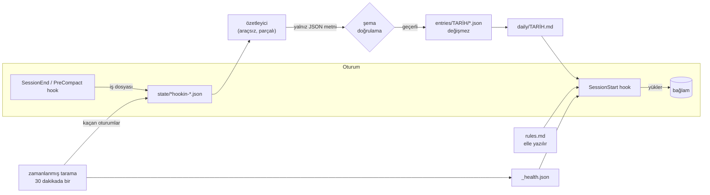

# ai-memory

**Türkçe** · [English](README.en.md)

[](https://github.com/Merttsengun/ai-memory/actions/workflows/tests.yml)

**Claude Code** ve **OpenAI Codex CLI** için proje bazlı, kalıcı hafıza. Yalnızca ajanların
kendi hook sistemleri kullanılır. Oturum bitince küçük, değiştirilemez kayıtlara özetlenir.
Aynı projede yeni bir oturum açtığınızda, hangi ajanla olursa olsun, kendi yazdığınız kurallar,
en son geçmiş ve tek satırlık bir sağlık durumu otomatik olarak yüklenir. "Nerede kalmıştık?"
diye anlatmanıza gerek kalmaz.

- **Tek hafıza, iki ajan.** Claude Code ve Codex aynı proje hafızasını okur ve yazar.
- **Hiçbir şey sessizce kaybolmaz.** Her oturum ya kaydedilir, ya kuyrukta bekler, ya da
  görünür bir hata olarak raporlanır. Zamanlanmış tarama, hook'u çalışmamış oturumları da bulur.
- **Önce güvenlik.** Oturum dökümleri güvenilmez kabul edilir, özetleyen modelin hiçbir aracı
  yoktur, diske yalnızca doğrulanmış JSON yazılır.
- **Klasör taşınsa da çalışır.** Git projeleri yoluyla değil, ilk commit'iyle tanınır.
- **Düz dosyalar.** Markdown ve JSON; klasörü Obsidian kasası olarak açabilirsiniz.
- **Bağımlılık yok.** Python standart kütüphanesi, `git` ve zaten kullandığınız `claude` / `codex`.

## Nasıl çalışır



Her proje `~/.ai-memory/projects/<proje-kimliği>/` altında kendi klasörünü alır:

| Dosya | Kim yazar | Oturum başında yüklenir mi |
|---|---|---|
| `projects/rules.md` | siz | her zaman, her projede |
| `<proje>/rules.md` | siz | her zaman, o projede |
| `<proje>/daily/YYYY-AA-GG.md` | kayıtlardan üretilir | en yenisi, tarihi ve kaç gün önce olduğuyla |
| `<proje>/entries/YYYY-AA-GG/*.json` | özetleyici | hayır (arşiv) |
| `<proje>/candidates.md` | kayıtlardan üretilir | hayır (sizin incelemeniz için) |
| `projects/Ana Sayfa.md`, `<proje>/<Ad>.md` | `vault.py` | hayır (gezinme sayfaları) |
| `<proje>/state/` | betikler (işler, kontrol noktaları) | hayır |

**Garanti edilen tek hafıza `rules.md`'dir**: koşulsuz yüklenir. O yüzden kısa tutun ve yalnızca
asla unutulmaması gereken kararları yazın. Geri kalanı yakın geçmiş ya da arşivdir; sistemi ne
kadar uzun kullanırsanız kullanın bağlam maliyeti sabit kalır. Boyut sınırları: global kurallar
12.000 bayt, proje kuralları 8.000, günlük not 4.000 (en yeni kısmı). Sınırı aşan kural dosyası
sessizce kesilmez; ajana kesildiği ve devamının nerede olduğu söylenir.

## Güvenilirlik

Hedef: bir oturumun içeriği **size haber verilmeden asla kaybolmasın**.

- **Sağlık satırı.** Her oturum tek satırla başlar:
  `[Hafıza sağlığı] Bu proje: son kayıt 2 sa önce · bekleyen 0 · başarısız 0 | zamanlayıcı 11:30 ✓`.
  Bir sorun varsa ne yapılacağıyla birlikte ⚠️ satırı eklenir ve ajan bunu ilk cevabında söyler.
- **Zamanlanmış tarama** (30 dakikada bir; Windows'ta zamanlanmış görev, diğerlerinde cron).
  Hook'u çalışmamış oturumları (kapanan terminal, kapanan editör) kuyruğa alır, bekleyen işleri
  tüm projelerde adil sırayla dener, geride kalan günlük notları yeniden üretir.
- **Hiçbir şey kesilmez.** Uzun oturumlar parçalara bölünür; her parça başarılı olur olmaz
  kaydedilir, yeniden denemede yalnız kalan parçalar işlenir. Devam eden oturumlarda yalnızca
  yeni kısım özetlenir; aynı şey iki kez kaydedilmez.
- **Geçici ve kalıcı hatalar ayrılır.** Kullanım sınırı ya da zaman aşımı deneme hakkı yemez,
  iş 30 dakika bekler. Diğer hatalar üç denemeden sonra `state/failed/`'e taşınır ve sağlık
  satırında görünür.
- **Duraklatma.** `python ~/.ai-memory/scripts/pause.py on` tüm otomatik özetleri durdurur
  (işler birikir, `off` ile işlenir).
- **Token takibi.** Her özet çağrısı ve her bağlam yüklemesi `projects/_usage.log`'a yazılır;
  sağlık satırı 7 günlük toplamı gösterir.
- **Atomik ve kilitli yazma.** Kayıtlar asla yarım yazılmaz ve üzerine yazılmaz.

## Güvenlik

Oturum dökümleri web sayfaları, dosya içerikleri ve araç çıktıları içerir; bu yüzden prompt
injection taşıyabilecek **güvenilmez girdi** sayılır.

1. **Özetleyici kutu içindedir.** Claude özetleri `claude -p --safe-mode --tools ""` ile boş bir
   geçici klasörde çalışır: modelin hiçbir aracı yoktur. Codex'te araçsız mod olmadığı için dosya
   okuyabilen ya da dışarı çıkabilen her özellik kapatılır, Codex ayarlarınız (MCP sunucuları)
   yüklenmez. **Bu varsayılmaz, test edilir:** `codex_isolation_test.py` özetleyiciden bir
   kanarya dosyası okumasını ister ve Codex'in olay akışında araç çağrısı arar. Sonuç Codex
   sürümüne bağlıdır; Codex güncellenince test yeniden geçene kadar Codex özetleri bekler
   (hiçbir şey kaybolmaz).
2. **Diske yalnızca kod yazar,** sıkı doğrulamadan sonra: beş alan zorunlu, tipler, uzunluk
   sınırları, kontrol karakterleri temizlenir. Talimat gibi görünen kural adayları
   (`SYSTEM:`, `IGNORE ALL ...`) kodda elenir.
3. **Yaygın gizli bilgi biçimleri maskelenir** (API anahtarları, token'lar, özel anahtarlar,
   parolalar); hem özetleyiciye gitmeden önce hem çıktısında. Desen eşleştirmedir: elden gelenin
   en iyisi, garanti değil.
4. **Yüklenen geçmiş güvenilmez diye etiketlenir.** Yalnızca sizin yazdığınız `rules.md`
   güvenilir olarak sunulur.
5. **Özyineleme ve alt ajan gürültüsü yok.** Claude Code içinden çağrılan Codex (örneğin bir
   inceleme) hafıza almaz ve özetlenmez; sonucu zaten ana oturumda.
6. **Hiçbir şey paylaşılmaz.** Tüm veri yerel dosyalardadır; tek ağ trafiği, kendi CLI
   aboneliğinizle yaptığınız özet çağrılarıdır.

## Kurallar ve kural adayları

Kurallar **asla otomatik yazılmaz.** Otomatik özet kural oluşturabilseydi, bir web sayfasındaki
tek bir cümle kendini kalıcı ve *güvenilir* bir talimata dönüştürebilirdi.

**Kural kaydetmek için** dosya aramanıza gerek yok, ajana söylemeniz yeter:

> Bunu bu projenin kuralı olarak kaydet: ödemeler Stripe'tan geçer, PayPal önerme.
>
> Bunu global kural yap: sunucum Coolify kullanıyor, deploy için yeniden derleme gerekir.

Ajana her oturum başında kural dosyalarının nerede olduğu ve onlara **yalnızca siz isteyince**
yazabileceği söylenir. Değişikliği normal dosya araçlarıyla yaptığı için yine sizin onayınızdan geçer.

**Kural adayları:** Bir oturumda kalıcı bir tercih belirttiğinizde ("bundan sonra önce test
yaz"), özetleyici bunu aday olarak kaydeder. Adaylar `<proje>/candidates.md`'de listelenir ve
**hiçbir oturuma yüklenmez**. İstediklerinizi kendiniz ya da ajana söyleyerek `rules.md`'ye
taşırsınız; taşınan aday listeden kendiliğinden düşer.

Neyin kural olduğu: doğru kalmaya devam eden karar kuraldır; iş bitince yanlış hale gelen şey
görevdir ve geçmişe aittir. Ajanın nasıl çalışacağına dair talimatlar `~/.claude/CLAUDE.md` ya da
`AGENTS.md`'ye daha uygundur.

## Proje kimliği

- **Git reposu:** `<klasör-adı>-g<sha256(ilk commit)[:15]>`. Klasörü taşımak, alt klasör açmak ya
  da adını değiştirmek aynı hafızayı korur.
- **Diğerleri:** normalleştirilmiş yolun hash'i. Git olmayan bir klasörü taşıdıysanız bir kez
  elle birleştirin:

```bash
python ~/.ai-memory/scripts/merge_projects.py --from <eski-kimlik> --into <yeni-kimlik> [--dry-run]
```

## Obsidian

`~/.ai-memory/projects` klasörünü **"Klasörü kasa olarak aç"** ile açın ve `Ana Sayfa`'dan
başlayın: projeler son çalışılma tarihine göre sıralı, her birinin klasör adını taşıyan bir
sayfası var. Aynı adlı klasörler üst klasör adıyla ayrılır (`app (müşteriler)`). Sol panelde
klasörler okunur adlarla görünür, teknik klasörler gizlenir; klasörlerin gerçek adı ve kayıt
yolları değişmez. Sayfalar her özetten sonra, yeni projede ve her taramada kendiliğinden
güncellenir; elle yazdığınız notlara dokunulmaz.

## Kurulum

Gereksinimler: Python 3.9+, `git` ve giriş yapılmış
[Claude Code](https://docs.claude.com/en/docs/claude-code) ve/veya [Codex](https://github.com/openai/codex) CLI.

```bash
git clone https://github.com/Merttsengun/ai-memory.git
cd ai-memory
python install.py --language Turkish --ui-language tr --user-name Ada   # Türkçe
python install.py --codex-model <küçük-model>       # Codex özetleri için ucuz bir model
python install.py --exclude "*-token" --exclude deneme   # tamamen dışarıda bırakılacak projeler
python install.py --no-codex                        # yalnız Claude Code
```

Kurucu kodu `~/.ai-memory`'ye kopyalar, `~/.claude/settings.json` ve `~/.codex/hooks.json`'a üç
hook ekler (önce yedek alır, yalnız `hooks` anahtarına dokunur), 30 dakikalık taramayı kaydeder
ve Codex izolasyon testini çalıştırır. Yeniden çalıştırmak kodu günceller, verinize dokunmaz.
Codex değişen hook'lar için `/hooks` ile onay ister.

Ayarlar `~/.ai-memory/config.json`'da (eksik olan varsayılana döner):

| Anahtar | Varsayılan | Anlamı |
|---|---|---|
| `language` | `English` | özetlerin dili |
| `ui_language` | `en` | sistem metinlerinin dili (`en` / `tr`) |
| `user_name` | boş | ajan talimatlarında adınız ("yalnızca Ada isteyince ...") |
| `claude_model` | `haiku` | Claude özetleri için model |
| `codex_model` | Codex varsayılanı | Codex özetleri için model (küçüğü yeter) |
| `exclude_projects` | `[]` | tamamen dışarıda bırakılan klasör adları / desenler |
| `pause_summaries` | `false` | tüm otomatik özetleri durdur |

Kaldırma (hook'ları ve görevi siler, hafızanızı korur): `python install.py --uninstall`

## İpuçları ve sınırlar

- Sağlık satırını okuyun; ⚠️ bir işin başarısız olduğunu, taramanın durduğunu ya da Codex
  özetlerinin beklediğini söyler. Tam rapor: `python ~/.ai-memory/scripts/health_report.py`.
- Son günlükten daha eskisine bakmak için ajandan `~/.ai-memory/projects/<kimlik>/entries/`
  içinde arama yapmasını isteyin.
- Bir oturum **başlatıldığı** projeye kaydedilir; aynı oturumda başka projede yapılan iş de
  ilk projeye yazılır.
- Gizli bilgi maskeleme desen eşleştirmedir: garanti değil.

## Geliştirme

```bash
python -m pytest -q
```

Testler geçici bir `AI_MEMORY_HOME`, sahte ayar dosyaları ve sahte `claude` / `codex` ile
çalışır: hiçbir model çağrılmaz, gerçek `~/.claude`, `~/.codex` ve zamanlanmış görevlere dokunulmaz.

## Lisans

MIT
