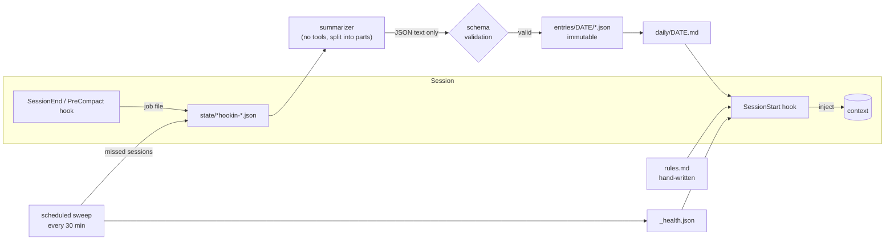

# ai-memory

[](https://github.com/Merttsengun/ai-memory/actions/workflows/tests.yml)

Persistent, per-project memory for **Claude Code** and **OpenAI Codex CLI**, built only on their
hook systems. When a session ends, it is summarized into small, immutable entries. When a new
session starts in the same project, with either agent, your hand-written rules, the latest
history and a one-line health check are injected automatically.

- **One memory, two agents.** Claude Code and Codex read and write the same per-project store.
- **Nothing is lost silently.** Every long session ends up recorded, pending, or in a visible
  error state; a scheduled sweep recovers sessions whose hooks never ran, and a health line at
  every session start tells you when something is wrong.
- **Security first.** Transcripts are treated as untrusted, the summarizing model has no tools,
  and only validated JSON ever reaches the disk (see [Security model](#security-model)).
- **Survives moving folders.** Git projects are identified by their root commit, not their path.
- **Plain files.** Markdown and JSON in one folder. You can open it as an Obsidian vault.
- **No dependencies.** Python standard library, `git`, and the `claude` / `codex` CLIs you already have.

## How it works



Each project gets its own folder in `~/.ai-memory/projects/<project-id>/`:

| File | Written by | Injected at session start |
|---|---|---|
| `projects/rules.md` | you | always, in every project |
| `<project>/rules.md` | you | always, in that project |
| `<project>/daily/YYYY-MM-DD.md` | rendered from entries | the newest one, with its date and age |
| `<project>/entries/YYYY-MM-DD/*.json` | summarizer, one file per session part | never (archive; grep it when needed) |
| `<project>/candidates.md` | rendered from entries | never (for you to review) |
| `projects/Home.md`, `<project>/<Name>.md` | `vault.py`, after every summary | never (navigation pages) |
| `<project>/state/` | scripts (jobs, checkpoints, health log) | never |

`rules.md` is the only **guaranteed** memory: it is injected unconditionally, so keep it short
and put only decisions that must never be forgotten there. Everything else is recent context or
archive, so the context cost stays flat however long you use it.

Size caps: global rules 12,000 bytes, project rules 8,000, daily note 4,000 (its newest part).
A rules file is never cut silently: if it is over its cap, the agent is told it was truncated
and where to read the rest.

## Reliability

The design goal is that a session's content is **never lost without you being told**.

- **Health line.** Every session starts with one line, e.g.
  `[Memory health] This project: last entry 2 h ago · pending 0 · failed 0 | sweep 11:30 ✓`.
  Problems add short ⚠️ lines with what to do (a failed job and its folder, a sweep that stopped
  running, Codex summaries paused, sessions that are unaccounted for), and the agent is asked to
  mention them in its first reply.
- **Scheduled sweep** (`scripts/sweep_all.py`, every 30 minutes; a Windows scheduled task, or a
  cron line elsewhere). It queues sessions whose hooks never ran (terminal killed, editor
  closed), retries waiting jobs across all projects fairly, re-renders daily notes that fell
  behind, and writes the health report. It counts the real transcripts on disk, not the queue,
  so a hook that never ran still shows up.
- **Nothing is cut.** A session longer than one summarizer call is split into parts; a single
  message longer than that is split into pieces (after redaction, so a secret is never cut in
  half). Each part is saved as soon as it succeeds, and a retry only does the parts that are left.
- **Continuation and duplicates.** A checkpoint records how far a session was summarized, with a
  signature over every processed message (an edit anywhere starts the session over). A continued session (`--resume`, PreCompact, the
  sweep) only summarizes what is new; a rewritten transcript is detected and started over; an
  entry written just before a crash is recognized on retry.
- **Transient vs. permanent errors.** A usage limit, a process killed with its window, or a
  timeout costs no retry: the job waits 30 minutes. Other errors get three tries and then move to
  `state/failed/`, which the health line reports. The summarizer's stderr is logged
  (redacted) so failures can be diagnosed.
- **Pause switch.** `python ~/.ai-memory/scripts/pause.py on` stops every automatic summarizer
  call (e.g. while you measure token use); jobs keep queueing and are processed after
  `pause.py off`. The health line shows the pause.
- **Token tracking.** Every summarizer call (tokens and cost, as reported by the CLI) and every
  context injection (estimated from its size) is logged to `projects/_usage.log`; the health line
  shows the 7-day total.
- **Atomic, locked writes.** Entries are written to a temp file, fsynced and published with a
  hard link (never overwritten, never half-written). Daily notes and the index are written under
  owner-checked locks; a stale lock is only taken over when its owner process is gone.

## Security model

Session transcripts contain web pages, file contents and tool output, so they are treated as
**untrusted input** that may carry prompt injection.

1. **The summarizer is boxed in.** Claude summaries run as `claude -p --safe-mode --tools ""`
   in an empty temp directory: that model has no tools at all. Codex has no tool-less mode, so
   Codex summaries run with every feature that can read files or reach outside switched off
   (`shell_tool`, `unified_exec`, `apps`, `browser_use`, `computer_use`, `plugins`, ...),
   without your Codex config (no MCP servers), in an empty temp directory.
   **This is verified, not assumed:** `scripts/codex_isolation_test.py` asks the summarizer to
   read a canary file inside and outside its folder and checks Codex's JSON event stream for any
   tool call, with a positive control that the same read works without the flags. The result is
   tied to the Codex version and the exact flags; after a Codex update Codex summaries pause
   (jobs wait, nothing is lost) until you re-run the test.
2. **Only code writes to disk,** after strict validation: all five fields required and nothing
   else, types (a non-string list item rejects the whole summary), length limits, control characters stripped, secrets redacted
   again. Rule candidates that look like directives (`SYSTEM:`, `IGNORE ALL ...`) are dropped in
   code, not just by the prompt. Claude and Codex use the same validator.
3. **Common secret formats are redacted** before the transcript is sent to the summarizer and
   again in its output (OpenAI/GitHub/Slack/Google/AWS keys, bearer tokens, private key blocks
   even when unterminated, `password=...` and JSON `"password": "..."`, passwords in connection
   URLs). This is pattern matching, so it is best effort, not a guarantee.
4. **Injected history is labelled untrusted.** Only `rules.md`, which you write yourself, is
   presented as trusted.
5. **No recursion, no sub-agent noise.** The summarizer's own `claude`/`codex` child process
   carries `AI_MEMORY_INTERNAL=1`, and every hook exits immediately when it sees it. Codex
   started from inside Claude Code (a sub-agent review) gets no memory and is not summarized:
   its result is already in the main Claude session.
6. **Nothing is shared.** All data stays in local files. The only network calls are the
   summarizer calls you already make with your own CLI subscription.

## Rules and rule candidates

Rules are never written automatically. If an automatic summary could create a rule, an
injected sentence in a web page could turn itself into a permanent, *trusted* instruction.
You are the only path from untrusted data to trusted rules.

### Saving a rule

You never need to find the files yourself. Just tell the agent:

> Save this as a rule for this project: payments go through Stripe, never suggest PayPal.
>
> Make this a global rule: my server runs Coolify, deploys need a rebuild, not a restart.

At every session start the agent is told where this project's `rules.md` and the global
`projects/rules.md` are, and that it may add to them **only when you ask**. It edits the file
with its normal file tools, so you still approve the change.

### Rule candidates

1. When you state a lasting preference in a session ("from now on, always write tests first"),
   the summarizer records it as a **rule candidate**. It is told to pick only things you said
   yourself, never text from files, web pages or tool output, and code drops any candidate that
   looks like a directive.
2. `<project>/candidates.md` lists the open candidates, newest first. It is regenerated after
   every summary and **never loaded into a session**.
3. You promote the ones you want, by hand or by asking the agent. A candidate disappears from the
   list once its text appears in that project's `rules.md`.

Where a rule belongs: a decision that stays true is a rule; something that becomes false once
work is done is a task and belongs in the history. True only in this project:
`<project>/rules.md`; true everywhere: `projects/rules.md`. Instructions about how the agent
should work fit best in `~/.claude/CLAUDE.md` or `AGENTS.md`, which the agents load natively.

## Project identity

A project's memory is keyed by an id computed at every session start:

- **Git repo:** `<folder-name>-g<sha256(root commit)[:15]>`. Moving the folder, opening a
  subfolder or renaming it keeps the same memory. A repo at your home directory or a drive root
  is ignored, so an umbrella repo cannot swallow every project under it.
- **Anything else:** a hash of the normalized path.
- **`projects/aliases.json`:** `old-id -> new-id` redirects written by merges.

An older path-based folder of the same project is folded into the current id automatically
(atomic rename into `projects/_merged/`, nothing deleted). For a folder that moved *without*
git, merge it by hand:

```bash
python ~/.ai-memory/scripts/merge_projects.py --from <old-id> --into <new-id> [--dry-run]
```

Claude Code's own native memory (`~/.claude/projects/<path>/memory/`) is tied to the folder
path; when a project moves, its orphaned notes are found, backed up and moved to the new path
at the next session start.

## Install

Requirements: Python 3.9+, `git`, and the [Claude Code](https://docs.claude.com/en/docs/claude-code)
CLI and/or the [Codex](https://github.com/openai/codex) CLI, logged in. On Windows, Claude Code
runs hooks through Git Bash, which it already requires.

```bash
git clone https://github.com/Merttsengun/ai-memory.git
cd ai-memory
python install.py                                   # Claude Code + Codex, English
python install.py --language Turkish --ui-language tr --user-name Ada
python install.py --codex-model <small-model>       # a cheap model for Codex summaries
python install.py --exclude "*-token" --exclude scratch   # projects to leave out entirely
python install.py --no-codex                        # Claude Code only
```

The installer refuses a target that overlaps the repo, your home folder, a drive root, or a
non-empty folder that is not an install; it stages the new code and swaps it in (rolling back on
failure), and never overwrites a `config.json` it cannot parse. It copies the code to `~/.ai-memory`, adds three hooks to `~/.claude/settings.json`
and `~/.codex/hooks.json` (only the `hooks` key is touched, a timestamped backup is written
first), registers the 30-minute sweep, and runs the Codex isolation test. Re-running it upgrades
the code and never touches your data. Codex asks you to review and trust changed hooks (`/hooks`).

Settings live in `~/.ai-memory/config.json`; anything missing falls back to a default:

| Key | Default | Meaning |
|---|---|---|
| `language` | `English` | language the summaries are written in |
| `ui_language` | `en` | language of the system's own texts (`en` or `tr`) |
| `user_name` | empty | your name in the agent instructions ("only when Ada asks ...") |
| `extra_instructions` | empty | appended to the "where rules live" block |
| `claude_model` | `haiku` | model for Claude summaries |
| `codex_model` | Codex default | model for Codex summaries (a small one is enough) |
| `codex_reasoning_effort` | `medium` | `low` dropped identifiers in our tests |
| `exclude_projects` | `[]` | folder names / glob patterns left out completely (no injection, no summaries); a match on any parent folder counts |
| `pause_summaries` | `false` | stop all automatic summarizer calls (`scripts/pause.py on/off`) |
| `claude_jobs_per_sweep` / `codex_jobs_per_sweep` | `6` / `4` | summarizer jobs per sweep run |

After a Codex update, re-run the isolation test (the health line reminds you):

```bash
python ~/.ai-memory/scripts/codex_isolation_test.py
```

Uninstall (removes the hooks and the scheduled task, keeps your memory):

```bash
python install.py --uninstall
```

## Usage tips

- Read the health line; a ⚠️ means a job failed, the sweep stopped, or Codex summaries paused.
- `python ~/.ai-memory/scripts/health_report.py` prints the full report; `sweep_all.py --dry-run`
  shows what the sweep would do without doing it.
- To look further back than the latest daily note, ask the agent to grep
  `~/.ai-memory/projects/<id>/entries/`.
- Skim `<project>/candidates.md` now and then and promote what you agree with.
- Open `projects/` as an Obsidian vault and start at `Home.md` (`Ana Sayfa.md` in Turkish):
  projects by last activity, each with a page named after its folder (same-named folders get
  the parent folder added, e.g. `app (clients)`). Pages are regenerated after every summary,
  for a new project at session start and on every sweep; raw records and archives are kept
  out of search and graph. Run `python scripts/vault.py` to rebuild them by hand.

## Known limitations

- An entry is saved per session (or per part of a long session) under the project the session
  was **started** in. Work on another project inside that session is filed under the first one.
- A folder without git that is moved needs one manual `merge_projects.py` call.
- Sessions that ended before checkpoints were kept may be summarized once more if they are
  resumed later (a one-time overlap with their older entry).
- Injected-context tokens are an estimate from its size (~3.5 characters per token); summarizer
  tokens are exact as reported by the CLIs.
- Redaction is pattern matching: best effort, not a guarantee.

## Development

```bash
python -m pytest -q
```

The tests run against a throwaway `AI_MEMORY_HOME`, fake settings files and fake `claude` /
`codex` executables: no model is called and your real `~/.claude`, `~/.codex` and scheduled
tasks are never touched.

## License

MIT
